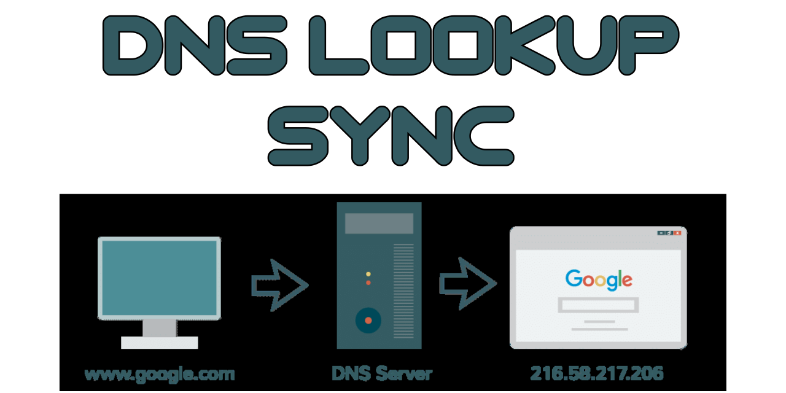

<div align="center">

# [](https://github.com/nktnet1/dns-lookup-sync)

[](https://github.com/nktnet1/dns-lookup-sync/actions/workflows/pipeline.yml)
&nbsp;
[](https://codecov.io/gh/nktnet1/dns-lookup-sync)
&nbsp;
[](https://codeclimate.com/github/nktnet1/dns-lookup-sync/maintainability)
&nbsp;
[](https://snyk.io/test/github/nktnet1/dns-lookup-sync)
&nbsp;
[](https://github.com/search?q=repo%3Anktnet1%2Fdns-lookup-sync++language%3ATypeScript&type=code)

[](https://www.npmjs.com/package/dns-lookup-sync?activeTab=versions)
&nbsp;
[](https://packagephobia.com/result?p=dns-lookup-sync)
&nbsp;
[](https://depfu.com/github/nktnet1/dns-lookup-sync?project_id=39390)
&nbsp;
[](https://opensource.org/license/mit/)
&nbsp;
[](https://github.com/nktnet1/dns-lookup-sync/issues)

[](https://sonarcloud.io/summary/new_code?id=nktnet1_dns-lookup-sync)
&nbsp;
[](https://app.codacy.com/gh/nktnet1/dns-lookup-sync/dashboard?utm_source=gh&utm_medium=referral&utm_content=&utm_campaign=Badge_grade)
&nbsp;
[](https://app.deepsource.com/gh/nktnet1/dns-lookup-sync/)
&nbsp;
[](https://codebeat.co/projects/github-com-nktnet1-dns-lookup-sync-main)
&nbsp;
[](https://github.com/nktnet1/dns-lookup-sync/stargazers)

[](https://moiva.io/?npm=dns-lookup-sync)
&nbsp;
[](https://moiva.io/?npm=dns-lookup-sync)
&nbsp;
[](https://moiva.io/?npm=dns-lookup-sync)
&nbsp;
[](https://moiva.io/?npm=dns-lookup-sync)
&nbsp;
[](https://moiva.io/?npm=dns-lookup-sync)

---

Synchronous version of [dnsPromises.lookup](https://nodejs.org/api/dns.html#dnspromiseslookuphostname-options)

[](https://replit.com/@nktnet1/dns-lookup-sync-example#index.js)

</div>

---

- [1. Installation](#1-installation)
- [2. Usage](#2-usage)
    - [2.1. hostname](#21-hostname)
    - [2.2. options](#22-options)
    - [2.3. return](#23-return)
- [3. License](#3-license)
- [4. Limitations](#4-limitations)
- [5. Caveats](#5-caveats)

## 1. Installation

```
npm install dns-lookup-sync
```

## 2. Usage

Try with [Replit](https://replit.com/@nktnet1/dns-lookup-sync-example#index.js).

The API is identical to [dnsPromises.lookup](https://nodejs.org/api/dns.html#dnspromiseslookuphostname-options), with the promise being unwrapped in the return type to achieve synchronicity.

```
dnsLookupSync(hostname, options);
```

<details closed>
<summary>Examples (click to view)</summary>

<br/>

Looking up `'localhost'` with default options

```javascript
const dnsLookupSync = require('dns-lookup-sync');

console.log(dnsLookupSync('localhost'));

// Sample output:
// { address: '127.0.0.1', family: 4 }

```

Looking up a list of addresses from `'www.google.com'`

```javascript
const dnsLookupSync = require('dns-lookup-sync');

console.log(dnsLookupSync('www.google.com', { all: true }));

// Sample output:
// [
//   { address: '172.217.167.100', family: 4 },
//   { address: '2404:6800:4006:80b::2004', family: 6 }
// ]
```


</details>

<br/>

### 2.1. hostname

Hostname string to look up. For example,
- `'localhost'`
- `'www.google.com'`

### 2.2. options

If an integer is passed, for example `4`, it is equivalent to passing the object `{ family: 4 }`.

<table>
  <tr>
    <th>Option</th>
    <th>Description</th>
    <th>Example</th>
    <th>Default</th>
  </tr>

  <tr>
    <td>family<br /><code>number</code></td>
    <td>
      The record family. Must be <code>4</code>, <code>6</code>, or <code>0</code>. The value <code>0</code> indicates that IPv4 and IPv6 addresses are both returned.
    </td>
    <td><code>4</code></td>
    <td><code>0</code></td>

  <tr>
    <td>hints<br/><code>number</code></td>
    <td>One or more <a href="https://nodejs.org/api/dns.html#supported-getaddrinfo-flags">supported getaddrinfo flags</a>. Multiple flags may be passed by bitwise ORing their values.</td>
    <td>
      <code>dns.ADDRCONFIG</code>
    </td>
    <td><code>undefined</code></td>
  </tr>

  <tr>
    <td>all<br/><code>boolean</code></td>
    <td>When true, the <code>dnsLookupSync</code> will return all addresses in an array. Otherwise, returns a single address</td>
    <td>
      <code>true</code>
    </td>
    <td><code>false</code></td>
  </tr>

  <tr>
    <td>verbatim<br/><code>boolean</code></td>
    <td>
      When true, the returns the IPv4 and IPv6 addresses in the order the DNS resolver returned them. When false, IPv4 addresses are placed before IPv6 addresses.
    </td>
    <td>
      <code>true</code>
    </td>
    <td><a href="https://nodejs.org/api/dns.html#dnspromiseslookuphostname-options">see docs</a></td>
  </tr>
</table>

### 2.3. return

By default, i.e.  `options.all === false`, a `LookupAddress` of the form
```typescript
{ address: string, family: number };
```

is returned. For example `localhost` may resolve to:
```javascript
{ address: '127.0.0.1', family: 4 }
```

Otherwise, an array of `LookupAddress` is returned. For example, [www.google.com](https://www.google.com) may resolve to:
```javascript
[
  { address: '142.250.204.4', family: 4 },
  { address: '2404:6800:4006:814::2004', family: 6 }
]
```


## 3. License

<details closed>
<summary>
  Massachusetts Institute of Technology
  (<a href="https://opensource.org/license/mit" target="_blank">MIT</a>)
</summary>

<br/>

```
Copyright (c) 2023 Khiet Tam Nguyen

Permission is hereby granted, free of charge, to any person obtaining a
copy of this software and associated documentation files (the “Software”),
to deal in the Software without restriction, including without limitation
the rights to use, copy, modify, merge, publish, distribute, sublicense,
and/or sell copies of the Software, and to permit persons to whom the
Software is furnished to do so, subject to the following conditions:

The above copyright notice and this permission notice shall be included in
all copies or substantial portions of the Software.

THE SOFTWARE IS PROVIDED “AS IS”, WITHOUT WARRANTY OF ANY KIND, EXPRESS OR
IMPLIED, INCLUDING BUT NOT LIMITED TO THE WARRANTIES OF MERCHANTABILITY,
FITNESS FOR A PARTICULAR PURPOSE AND NONINFRINGEMENT. IN NO EVENT SHALL
THE AUTHORS OR COPYRIGHT HOLDERS BE LIABLE FOR ANY CLAIM, DAMAGES OR OTHER
LIABILITY, WHETHER IN AN ACTION OF CONTRACT, TORT OR OTHERWISE, ARISING
FROM, OUT OF OR IN CONNECTION WITH THE SOFTWARE OR THE USE OR OTHER
DEALINGS IN THE SOFTWARE.
```

</details>

## 4. Limitations

There are currently no known limitations.

## 5. Caveats
